# Lab1Web

## Nama : Pikri Ramdani
## NIM  : 312010162
## Kelas: TI.20 A.1
## Matkul: Pemograman Web

## Belajar dasar HTML
## Langkah - Langkah Praktikum

  *assalamualakum*
  Nama saya Pikri Ramdani disini saya akan menjelaskan cara membuat web dengan html
  Pertama siapkan Visual Studio Code dan browser
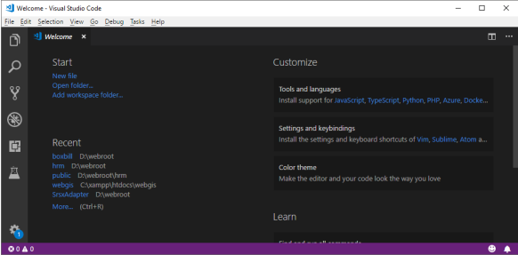

  kemudian buat file baru dengan nama **lab1_tag_latihandasar.html**
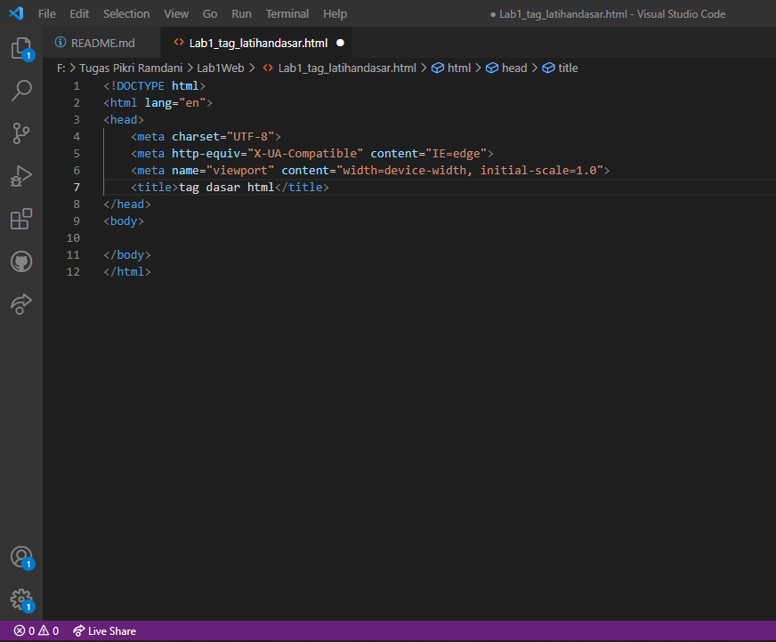

  Selanjutnya buka file tersebut menggunakan browser.Disini saya menggunakan *microsoft eddge*
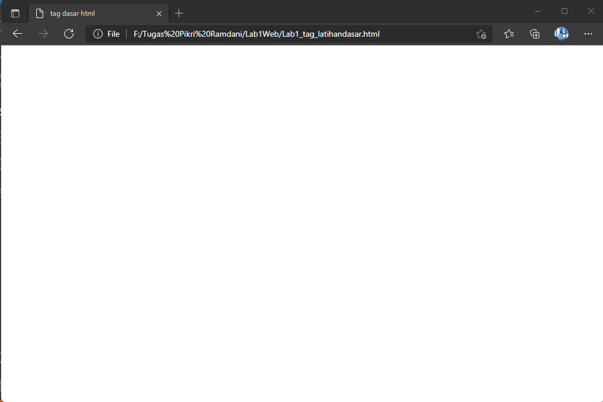

## 1.Membuat Paragraf
  Buatlah Paragraf Sederhana seperti berikut ini. dan kemudian lihat hasilnya dengan menrefresh pada web browser
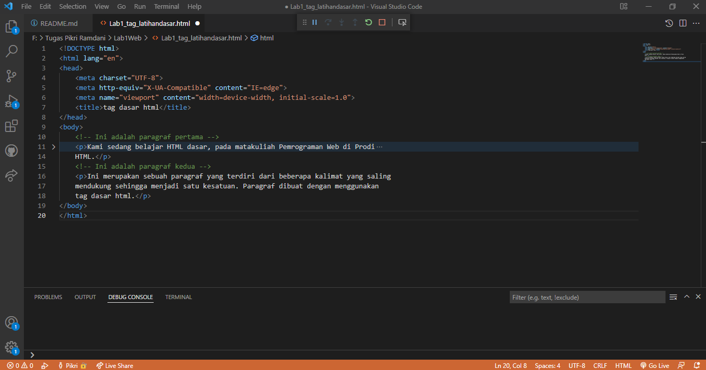
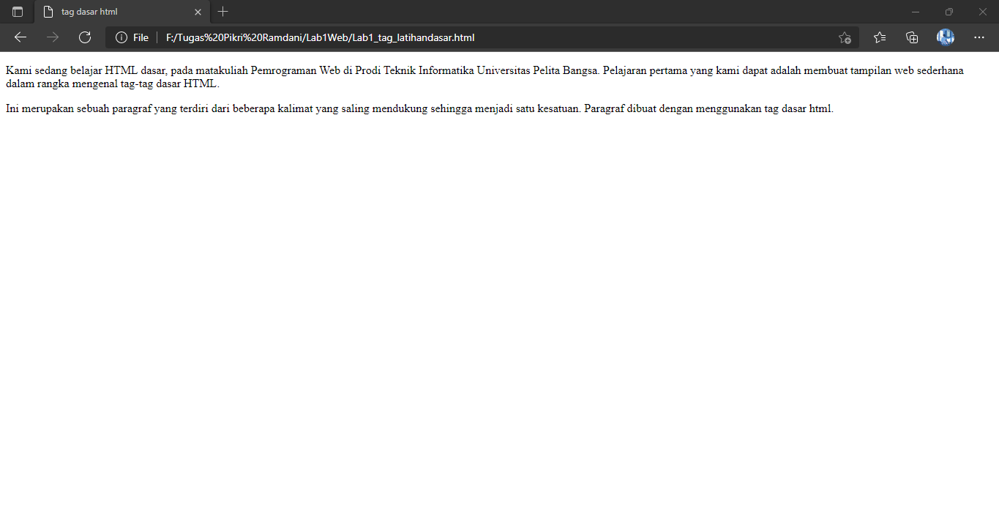

  kemudian atur atribut paragraf seperti berikut dan lihat perubahannya
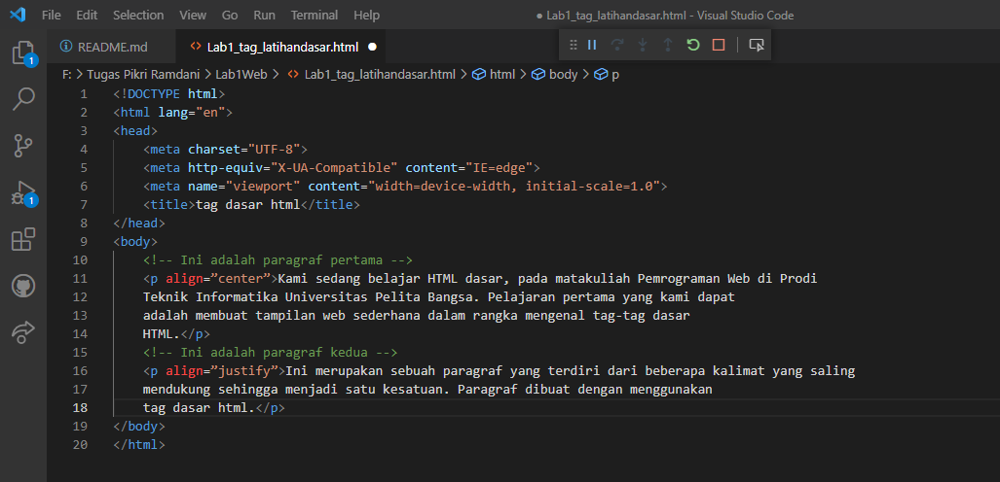
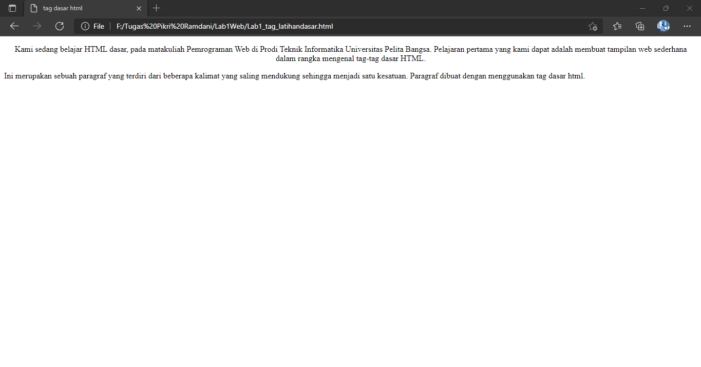

  Simpan dan refresh web browser untuk melihat perubahannya. selanjutnya untuk mengubah model paragraf nilai atributnya (align= justify,left,left,right dan center) untuk melihat perbedaanya.

## 2.Menambahkan Judul
  Judul memliki 6 level yang berbeda mulai dari h1 sampai h6. kemudian tambahkan judul h1 sebelum paragraf pertama dan tambahkan sub-judul h2 sebelum paragraf ke 2
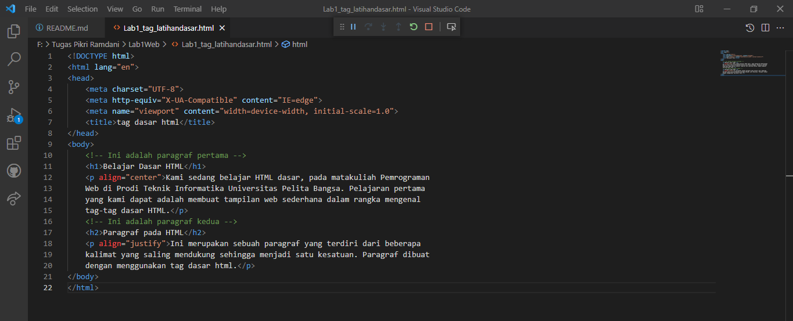
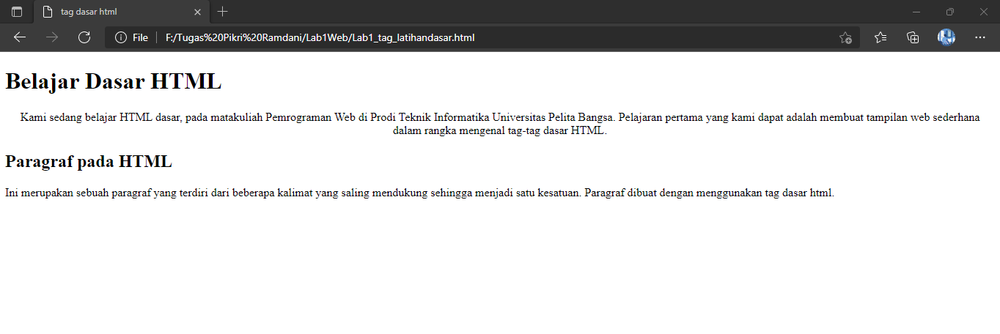

## 3.Memformat Teks
  lakukan performatan teks yang ada pada paragraf yang sudah ada sebelumnya, mengacu pada penejlasan materi performatan teks sehingga tampilannya akan berbeda seperti berikut.
  masukan code teks seperti berikut untuk melihat perubahan
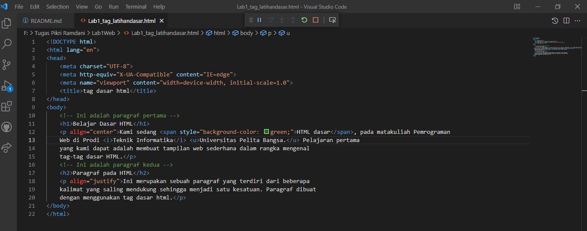

  dan hasilnya akan seperti ini
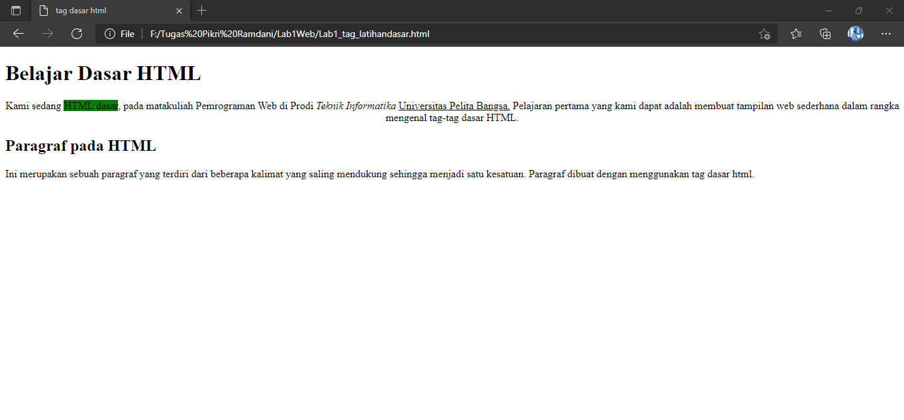

## 4.Menyisipkan gambar
  untuk menyisipkan gambar, siapkan terlebih dahulu gambar yang ingin dimasukan pada HTML dan sisipkan atau taruh gambar pada satu folder dengan HTML seperti gambar berikut :
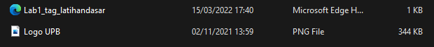

  Kemudian tambahkan tag img setelah paragraf kedua, dengan menambahkan Heading 3 sebelumnya seperti berikut :
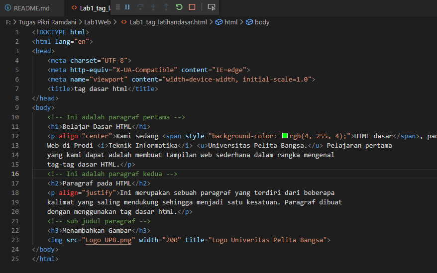

  gambar akan di tampilkan apa adanya sesuai ukuran aslinya. untuk mengatur ukuran gambar, dapat menggunakan atribut widht dan height dengan nilai interger yang di sesuaikan seperti contoh diatas . nanti gambar akan sepeti berikut ini :
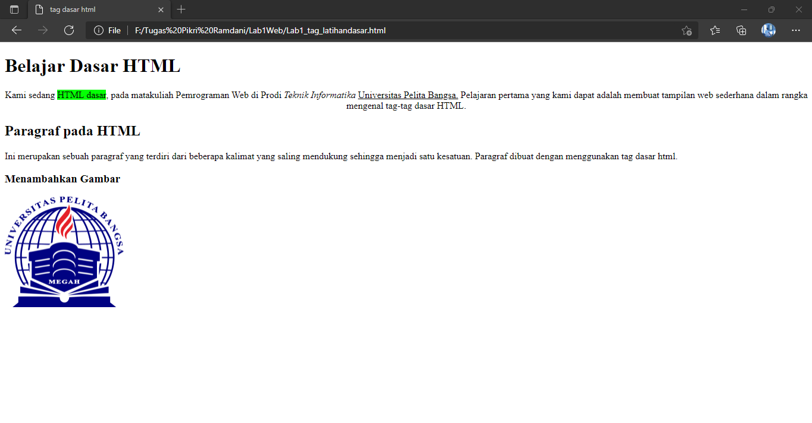

## Menambahkan Hyper Links

  tambahkan Hyperlink pada dokumen sebelum heading 1 seperti gambar berikut :
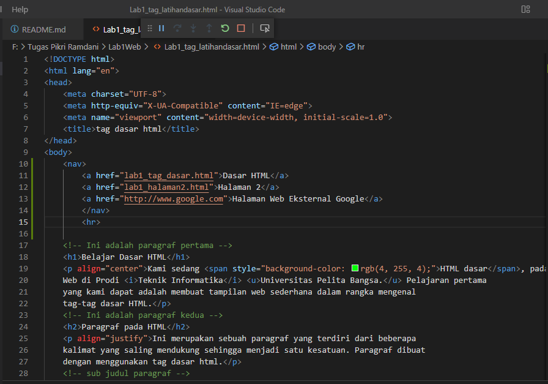

  Nanti Hyperlink akan berada di atas seperti gambar berikut :
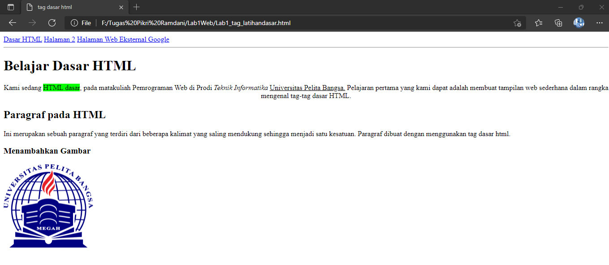

  Sekian penjelasan dari saya tentang membuat HTML menggunakan VSCode semoga mudah di mengerti sekian dari saya. 
  Terima Kasih

## Jawab Pertanyaan Berikut :
  1.Lakukan perubahan pada kode sesuai dengan keinginan anda, amati perubahannya adakah error ketika terjadi kesalahan penulisan tag?
  2.Apa perbedaan dari tag < p > dengan tag < br >, berikan penjelasannya!
  3.Apa perbedaan atribut title dan alt pada tag, berikan penjelasannya!
  4.Untuk mengatur ukuran gambar, digunakan atribut widht dan height. agar tampilan gambar proporsional sebaiknya kedua atribut tersebut diisi semua atau tidak? Berikan penjelasannya!
  5.Pada link tambahkan atribut target dengan nilai atribut bervariasi (_blank,_self,_top,_parent)

## Jawaban

  1.Saya akan melakukan perbedaan tag HTML sebelum dan sesudah perubahan.
  sebelum perubahan akan seperti gambar berikut :

  setelah perubahan gambar akan seperti berikut :

  Disini saya melakukan perubahan dengan menghilangkan tag `<h/1>` menjadi `<h1>` maka akan terjadi seluruh elemen dibawah tag tersebut akan berubah mengikuti tag `<h1>` dikarenakan tidak ada penutup pada tag tersebut.

