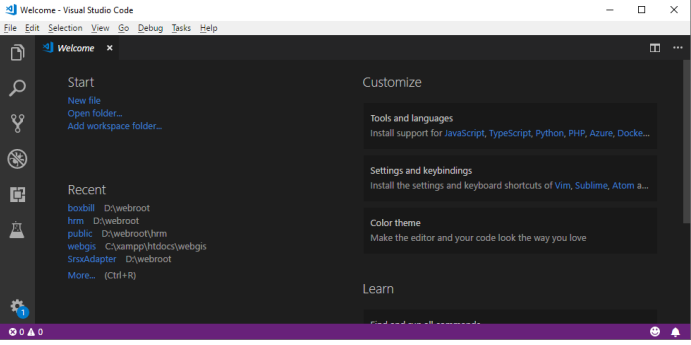

# Lab1Web

## Nama : Pikri Ramdani
## NIM  : 312010162
## Kelas: TI.20 A.1
## Matkul: Pemograman Web

## Belajar dasar HTML
## Langkah - Langkah Praktikum

  disini saya akan menjelaskan cara membuat web dengan html
  Pertama Siapkan VSCODE

 